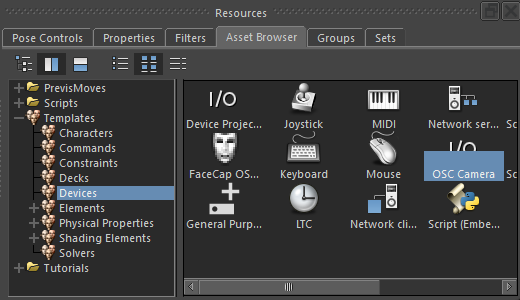
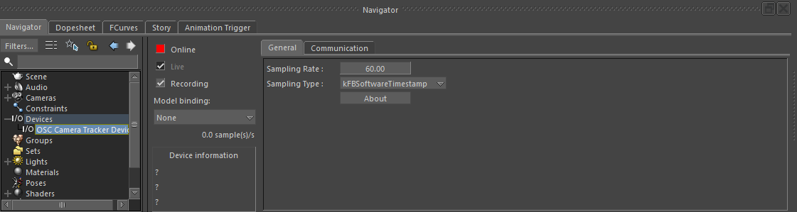
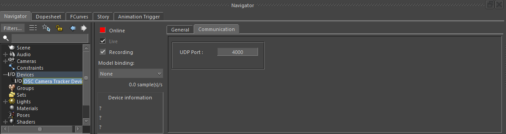
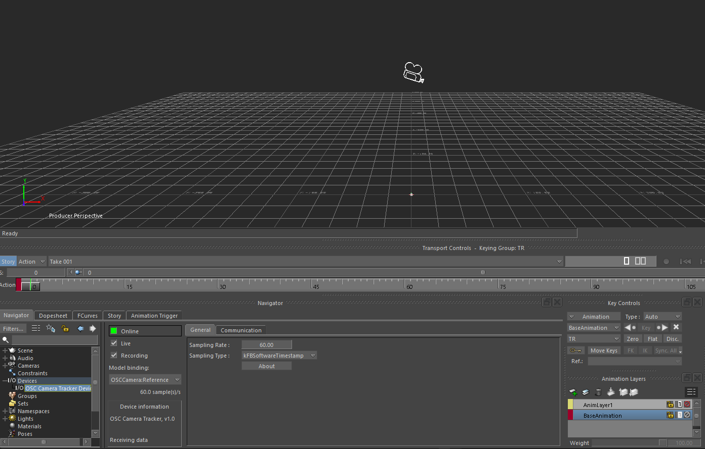
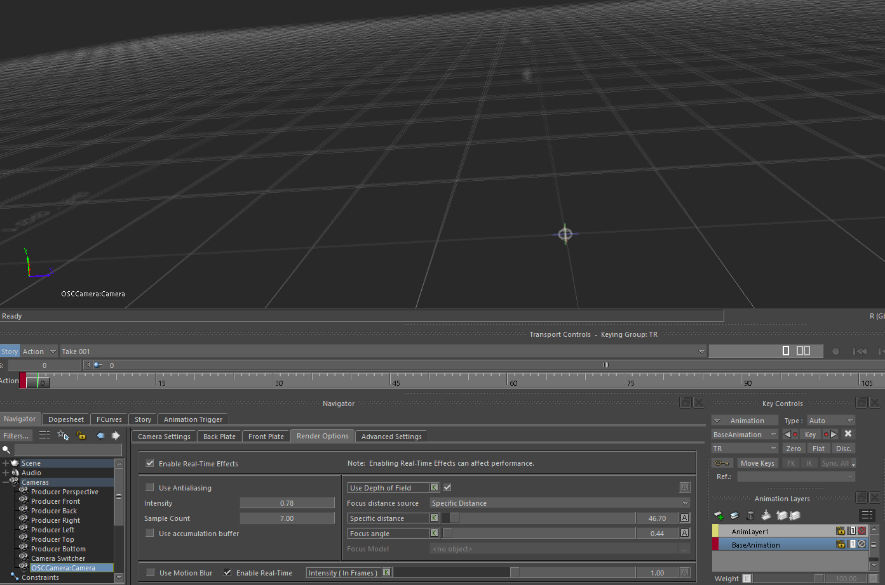

# mobu-device-camera-plugin

OSC based camera tracker device plugin for Autodesk MotionBuilder.

The device listens to the 6DoF Camera Tracker OSC stream (UDP) and drives a MotionBuilder camera in real time:
transform, focal length, focus distance and the depth of field cone (focus angle). It can record the incoming
poses as animation keys.

Plugin file: `device_oscCamera.dll`. Windows, MotionBuilder 2025 by default (see [Build](#build) for other versions).

## OSC stream

The device accepts these messages and ignores everything else. A truncated or malformed datagram is rejected,
never read past its end.

| Address | Type tags | Content |
|---|---|---|
| `/livetracker/pose` | `,iffffffiii` | camera id, pan, tilt, roll (degrees), x, y, z (metres x Space scale), zoom, focus, iris |
| `/livetracker/lens` | `,iiiffffff` | zoom / focus / iris calibrated flags, then min and max of zoom (mm), focus (m), iris (f-number) |
| `/livetracker/diag` | `,ih` | sequence number, send time (unix ms) - used to count lost packets |

Wire frame is X right, Y forward, Z up (right handed, "Default" axis mapping of the tracker app). It is converted to the
MotionBuilder frame (X forward, Y up, Z right, centimetres), so the zero pose of the tracker is the zero rotation of a
MotionBuilder camera.

Lens channels that are calibrated in the app (`/livetracker/lens`) are taken as physical values. Channels that are
not calibrated are remapped from the raw encoder range to a range you set on the device (see the `... Raw Range` and
`... Output Range` properties below).

## Usage

1. Install the plugin, then restart MotionBuilder:
   * **Installer** - run `Setup_TechStoryOSCCamera_MoBu.exe`, tick the MotionBuilder versions to install for
     (the plugin goes into `bin\x64\plugins` of each selected installation, administrator rights are needed), or
   * **Manually** - copy `device_oscCamera.dll` into a MotionBuilder plugins folder
     (e.g. `C:\Program Files\Autodesk\MotionBuilder 2025\bin\x64\plugins`).
2. In the Asset Browser go to **Templates > Devices** and drag **OSC Camera Tracker Device** into the scene.

   

3. Select the device in the Navigator (**Devices**). The **General** tab has the sampling settings. Set the
   **Sampling Rate** to the rate the tracker app streams at, so every incoming pose is picked up
   (the default 60 is only a starting value; the measured rate of the stream is shown by the read only
   `Receive Rate (Hz)` property):

   

4. In the device **Communication** tab set the **UDP Port** to the *Target Port* of the tracker app. Make sure the phone/PC and
   MotionBuilder are on the same network and the firewall lets UDP in on that port.

   

5. Put the device **Online**. The status shows `Listening on UDP port ...`, then `Receiving data` once poses arrive,
   or `No data` when the stream is silent for longer than the **Timeout**.
6. Open the **Model binding**, create/pick a camera and bind it to the **Camera** template. The transform is driven by
   the device, the lens (focal length, focus distance, focus angle) is connected to the camera automatically.
   In the screenshot below the device is online (green), bound to the `OSCCamera:Reference` model and receiving data.
   The 60 samples/s shown there is the device sampling rate used for the demonstration, in practice it follows the rate
   of the streaming device.

   

7. Enable **Recording** on the device to key the incoming poses.

The camera lens is driven by the stream too: with **Use Depth of Field** on in the camera **Render Options**, the
**Specific distance** (focus distance) and the **Focus angle** follow the device.



The device also has an **Iris** (f-number) output that a camera does not have a property for. Use it in a relation
constraint, e.g. to drive a depth of field effect.

### Device properties

| Property | Description |
|---|---|
| `Port` | UDP port to listen to (default 4000) |
| `Camera ID` | accept only this camera id from the stream, -1 - any |
| `Timeout (ms)` | time without a pose after which the stream is reported as `No data` |
| `Log Packets` | trace the received messages into the MotionBuilder log |
| `Receive Rate (Hz)` | poses received per second, read only |
| `Lost Packets` | frames missing in the stream, counted from the diagnostics sequence (turn *Stream diagnostics* on in the app), read only |
| `Space Scale` | wire position units to centimetres: 100 - the app sends metres, 1 - the app's Space scale is 100 |
| `Position Sign` | per axis flip of the wire position, fixes a mismatching axis mapping |
| `Rotation Sign` | per angle flip of the wire pan, tilt, roll |
| `Focus Angle Scale` | multiplier of the focus angle computed from the iris, focal length and focus distance |
| `Zoom / Focus / Iris Raw Range` | raw encoder range of a channel that is not calibrated in the app |
| `Zoom / Focus / Iris Output Range` | what that raw range is remapped to: focal length (mm), focus distance (cm), f-number |

The port is bound when the device goes online, so restart the device after changing it.

## Build

Requirements
* Windows, Visual Studio 2022 (MSVC)
* CMake 3.19+
* Autodesk MotionBuilder with its OpenReality SDK (the SDK is installed together with MotionBuilder)

```bat
cmake -S . -B build -G "Visual Studio 17 2022" -A x64
cmake --build build --config RelWithDebInfo --target device_oscCamera
```

The plugin is `build\RelWithDebInfo\device_oscCamera.dll`.

CMake options

| Option | Default | Description |
|---|---|---|
| `MOBU_VERSION` | `2025` | MotionBuilder version to build against, must match the `MOBU_ROOT` installation |
| `MOBU_ROOT` | `C:/Program Files/Autodesk/MotionBuilder <MOBU_VERSION>` | MotionBuilder installation folder |
| `OPENREALITY_ROOT` | `<MOBU_ROOT>/OpenRealitySDK` | OpenReality SDK folder (headers and import libraries) |
| `COPY_TO_PLUGINS` | `OFF` | copy the built dll into `MOBU_PLUGINS_DIR` after every build |
| `MOBU_PLUGINS_DIR` | `<MOBU_ROOT>/bin/x64/plugins` | destination of `COPY_TO_PLUGINS` (a folder under Program Files needs administrator rights) |

For example, to build for MotionBuilder 2024 and copy the dll into a custom plugins folder:

```bat
cmake -S . -B build -G "Visual Studio 17 2022" -A x64 -DMOBU_VERSION=2024 -DCOPY_TO_PLUGINS=ON -DMOBU_PLUGINS_DIR=D:/MyPlugins
```

## Tests

The OSC decoder (`src/osc_camera_decoder.h`) and the camera math (`src/osc_camera_math.h`) are header-only and do not
depend on the SDK, so they are tested standalone. The tests are not part of the default build:

```bat
cmake --build build --config RelWithDebInfo --target device_oscCamera_decoder_test device_oscCamera_math_test
build\RelWithDebInfo\device_oscCamera_decoder_test.exe
build\RelWithDebInfo\device_oscCamera_math_test.exe
```

## Source layout

| File | Content |
|---|---|
| `src/device_osccamera.cxx` | library registration |
| `src/device_osccamera_device.*` | the device: properties, animation nodes, evaluation, recording, stream status |
| `src/device_osccamera_hardware.*` | UDP receiving (through `FBTCPIP`, no platform sockets) |
| `src/device_osccamera_layout.*` | the device UI |
| `src/osc_camera_decoder.h` | strict OSC decoder |
| `src/osc_camera_math.h` | conversion to the MotionBuilder frame and units, lens and focus angle |
| `tests/` | standalone tests |

## License

MIT, see [LICENSE](LICENSE).
